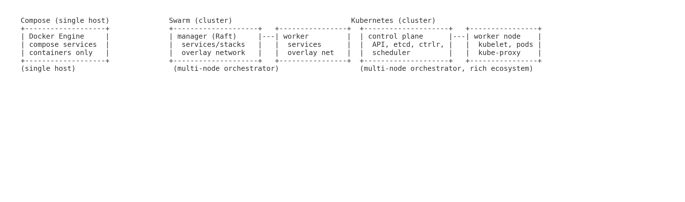

# Docker Swarm (notes)

- Built-in orchestrator (older than K8s), simple to start
- Concepts: **node** (manager/worker), **service**, **task**, **stack**
- Pros: easy, native to Docker; Cons: less ecosystem than Kubernetes
- Good stepping stone to understand orchestration (replicas, rolling updates)



| Topic            | Docker Compose (single host)          | Docker Swarm (cluster)                        | Kubernetes (cluster)                                  |
|------------------|---------------------------------------|-----------------------------------------------|-------------------------------------------------------|
| Scope            | One machine, multi-container dev      | Multi-node orchestrator (services, stacks)    | Multi-node orchestrator (pods, deployments, etc.)     |
| Scaling          | `--scale` flag                        | `docker service scale`                        | `kubectl scale` (HPA/auto available)                  |
| LB / Service Disc| Basic container links                 | Built-in VIP + DNS, overlay networks          | Services/Endpoints, kube-proxy, CNI                   |
| Config format    | `compose.yaml`                        | `docker-stack.yml` (Compose v3)               | YAML manifests (`Deployment`, `Service`, etc.)        |
| CLI              | `docker compose up/down`              | `docker swarm init`, `docker stack deploy`    | `kubectl apply/get/describe/rollout`                  |
| Typical use      | Local dev, simple multi-service apps  | Simple clustering with Docker UX              | Production, rich ecosystem & extensibility            |

## Compose
 ```
docker compose up -d 
 docker compose ps 
 docker compose down
```
## Swarm
```
docker swarm init
docker stack deploy -c docker-stack.yml app
docker service scale app_web=3
docker stack rm app
docker swarm leave --force
```
## Kubernetes
```
kubectl create deployment web --image=nginx:alpine
kubectl expose deployment web --port=80 --type=NodePort
kubectl scale deployment web --replicas=3
kubectl set image deployment/web nginx=nginx:1.27-alpine
kubectl rollout status deployment/web
kubectl delete svc/web deploy/web
```
