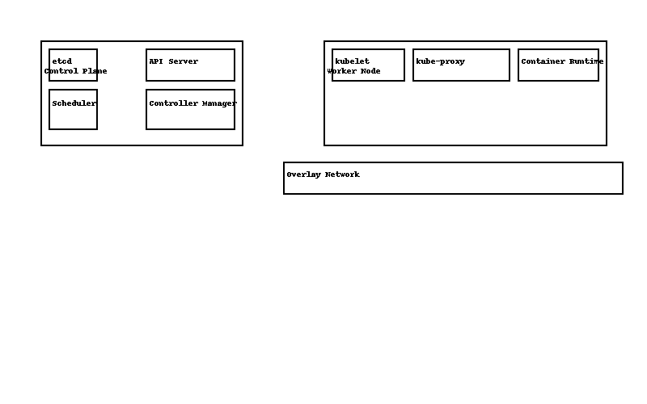

# 01 — Kubernetes Introduction

 **Learning objectives**
 - Understand Control Plane vs Worker Node roles  
 - Know the responsibilities of etcd, API server, scheduler, controllers, kubelet, kube-proxy  
 - Understand basic networking (overlay, kube-proxy)  
 - Be able to run a single-node lab (minikube) and verify the cluster

---

## Summary (tl;dr)
**Control Plane:** `etcd` (cluster state), `kube-apiserver` (front door/API), `kube-scheduler` (pod placement), `kube-controller-manager` (reconciliation).  
**Worker Node:** `kubelet` (talks to API; manages pods), `kube-proxy` (node networking), **container runtime** (e.g., containerd).  
**Networking:** CNI plugin provides pod networking; `kube-proxy` programs data-plane rules for Services.  
**Lab setup:** Single-node with **minikube** is ideal; includes **CoreDNS** for service DNS.

---

## Kubernetes Architecture Diagram




---

## Core components at a glance
- **etcd** – key/value store for all cluster state.  
- **API Server** – single entry point; validates/serves the Kubernetes API.  
- **Scheduler** – assigns Pods to Nodes based on resources/constraints.  
- **Controller Manager** – reconciliation loops (Deployments, Nodes, etc.).  
- **kubelet** – node agent; ensures containers for assigned Pods are running.  
- **kube-proxy** – implements Service VIPs via iptables/ipvs rules on nodes.  
- **Container runtime** – pulls images & runs containers (e.g., containerd).

---
## Objects you’ll meet first
- **Pod** – smallest deployable unit
- **Deployment** – manages replicas & rolling updates
- **Service** – stable access to Pods
- **Namespace** – logical isolation
- **Node** – a worker machine in the cluster
---

## Quick verifications 
```
kubectl cluster-info
kubectl get nodes
kubectl get pods -A
```
Full walkthrough in: ../..labs/kubernetes/lab01_setup-minikube/README.md 

CLI details next: ./02_kubectl.md
